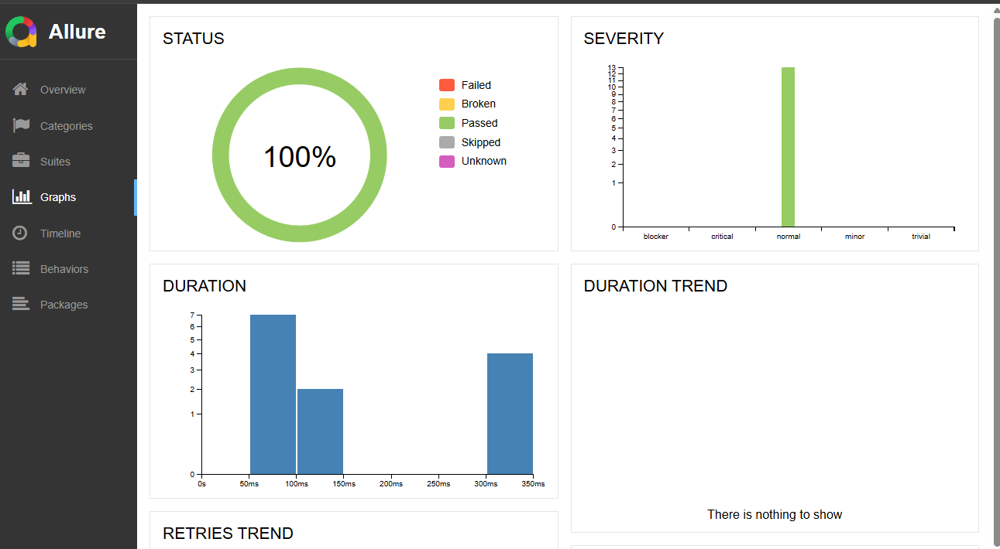
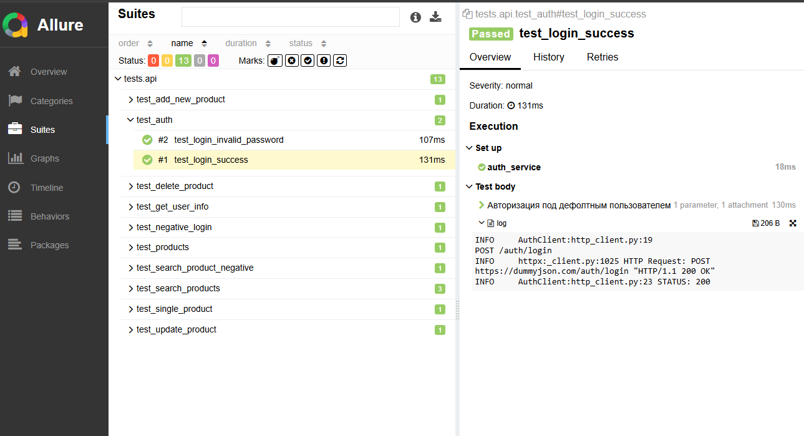

# API Automation Testing Framework (DummyJSON)
A professional, production-ready automated testing framework for the [DummyJSON API](https://dummyjson.com). This project demonstrates scalable architecture, robust data validation, and seamless CI/CD integration.

## Live Report
**View the latest test execution results here:** [Allure Report on GitHub Pages](https://github.io)

## Tech Stack
* **Python 3.11+**
* **Pytest** — Powerful testing engine.
* **HTTPX** — Modern, fast HTTP client for Python.
* **Pydantic V2** — Strict data validation and settings management.
* **Allure Reports** — Rich, interactive test reporting with steps and attachments.
* **Docker & Docker Compose** — Containerization for consistent test environments.
* **GitHub Actions** — Full CI/CD pipeline for automated testing and report deployment.

## Framework Architecture
The project follows a **Layered Architecture** pattern to ensure maintainability:
* `core/` — The "engine": Base HTTP client with built-in logging, request/response attaching for Allure, and error handling.
* `clients/` — API clients defining low-level endpoint interactions.
* `services/` — Business logic layer: manages sessions, tokens, and complex test scenarios.
* `schemas/` — Pydantic models for automatic JSON schema validation.
* `utils/` — Reusable helpers: custom validators, retry decorators, and logging utilities.
* `tests/` — Test suites organized by functional modules (Auth, Products, etc.).

## Key Features
* **Resilience**: Implemented a **Retry mechanism** to handle unstable API endpoints (flaky tests).
* **Deep Validation**: Beyond status codes—validates data integrity, field types, and response latency.
* **Session Optimization**: Leverages `session-scoped` fixtures to minimize redundant authentication calls.
* **Observability**: Detailed Allure reports featuring execution steps and full HTTP request/response logs.

## Getting Started

### 1. Local Execution (Python)
```bash
python -m venv .venv
# Windows: .venv\Scripts\activate | Mac/Linux: source .venv/bin/activate
pip install -r requirements.txt
pytest --alluredir=allure-results
allure serve allure-results
```

### 2. Docker Execution (Isolated Environment)
```bash
docker-compose build
docker-compose up
```
*Test results are automatically synchronized with the local `allure-results` folder.*

## CI/CD Pipeline
The project includes a GitHub Actions workflow (`tests.yml`) that automatically:
1. Provisions the environment and installs dependencies.
2. Executes the full test suite.
3. Generates and deploys the up-to-date Allure report to the `gh-pages` branch.

## Test Coverage
* **Auth**: Positive/Negative login scenarios, Current User profile validation.
* **Products**: Full CRUD cycle (Create, Read, Update, Delete), Parameterized search functionality.
---
# API Automation Testing Framework (DummyJSON)

Профессиональный фреймворк для автоматизации тестирования [DummyJSON API](https://dummyjson.com). Проект демонстрирует навыки построения масштабируемой архитектуры, контейнеризации и настройки CI/CD циклов.

## Live Report
 **Результаты последних тестов всегда доступны здесь:** [Allure Report on GitHub Pages](https://github.io)

## Стек технологий
* **Python 3.11+**
* **Pytest** — тестовый движок.
* **HTTPX** — современный асинхронный HTTP-клиент.
* **Pydantic V2** — строгая валидация схем данных.
* **Allure Reports** — интерактивные отчеты с визуализацией шагов.
* **Docker & Docker Compose** — контейнеризация тестов для изолированного запуска.
* **GitHub Actions** — автоматический запуск тестов и деплой отчетов (CI/CD).

## Архитектура проекта
Проект построен по принципу многослойности (Layered Architecture):
* `core/` — базовый HTTP-клиент с логированием и механизмом Retries.
* `clients/` — описание эндпоинтов API.
* `services/` — бизнес-логика: управление сессиями, токенами и сборка сценариев.
* `schemas/` — Pydantic-модели для автоматической валидации JSON-ответов.
* `utils/` — вспомогательные инструменты: валидаторы и декораторы.
* `tests/` — тестовые сценарии, разделенные по функциональным модулям.

## Варианты запуска

### 1. Локальный запуск (Python)
```bash
python -m venv .venv
# Windows: .venv\Scripts\activate | Mac/Linux: source .venv/bin/activate
pip install -r requirements.txt
pytest --alluredir=allure-results
allure serve allure-results
```

### 2. Запуск в Docker (Изолированная среда)
```bash
docker-compose build
docker-compose up
```
*Результаты тестов автоматически синхронизируются с папкой `allure-results` на хосте.*

## CI/CD Pipeline
В проекте настроен GitHub Actions (`tests.yml`), который при каждом пуше:
1. Поднимает окружение и устанавливает зависимости.
2. Запускает весь набор тестов.
3. Генерирует и публикует актуальный Allure-отчет в ветку `gh-pages`.

## Покрытие тестами
* **Auth**: Positive/Negative login, Profile data.
* **Products**: CRUD операции (Create, Read, Update, Delete), поиск с параметризацией.

## Визуализация отчетов

*Общий статус прохождения тестов*


*Детализация шагов и логирование запросов*
